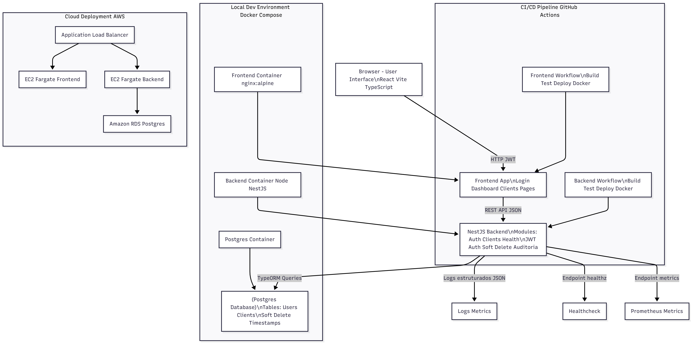

# 🧩 Desafio Técnico – Tech Manager - Teddy Open Finance  
**Monorepo Nx | Backend NestJS + Frontend React (Vite) | CI/CD | Docker**

---

## 📘 Visão Geral

Este projeto foi desenvolvido como parte do desafio técnico para a **Teddy Open Finance**, com o objetivo de demonstrar domínio em **engenharia de software moderna**, cobrindo **backend escalável, frontend reativo e integração contínua** em um ambiente **monorepo Nx**.

A solução foi construída com foco em **qualidade, manutenibilidade e boas práticas corporativas**, simulando um ambiente real de produto digital.

---

## 🏗️ Arquitetura Geral

O repositório segue a estrutura de um **monorepo Nx**, permitindo gestão unificada de múltiplos aplicativos e bibliotecas compartilhadas.

```
📦 teddy-open-finance/
├── apps/
│   ├── backend/          # API NestJS (TypeORM, PostgreSQL, Jest)
│   └── frontend/         # React + Vite + Jest + Testing Library
├── docker-compose.yml    # Infraestrutura local (Backend + Frontend + DB)
├── nx.json
├── package.json
├── tsconfig.base.json
└── README.md
```

### 🔹 Backend (`apps/backend`)
- **Framework:** [NestJS](https://nestjs.com/)  
- **ORM:** TypeORM (com suporte a PostgreSQL)  
- **Testes:** Jest  
- **Arquitetura:** modular e orientada a domínio  
- **Boas práticas:** DTOs, Services, Controllers, Soft Delete, Repositórios tipados  

### 🔹 Frontend (`apps/frontend`)
- **Framework:** React + Vite  
- **Linguagem:** TypeScript  
- **Testes:** Jest + React Testing Library  
- **Build:** otimizado via Vite  
- **Cobertura de testes:** 100% nas camadas unitárias  

---

## Escopo Funcional (MVP)

**Autenticação:**
- Login com e-mail/senha usando JWT

**CRUD de Clientes:**
- Criar, listar, editar, excluir (soft delete)
- Detalhes do cliente com contador de acessos
- Auditoria com timestamps

**Dashboard/Admin:**
- Totais
- Últimos clientes cadastrados
- Gráfico de clientes

---

## Endpoints Backend

| Método | Endpoint            | Descrição                       |
|--------|------------------|---------------------------------|
| POST   | /auth/login       | Autenticação                    |
| POST   | /clients          | Criação de cliente (auth)       |
| GET    | /clients          | Listagem de clientes (auth)     |
| GET    | /clients/:id      | Detalhe + contador (auth)       |
| PUT    | /clients/:id      | Atualização (auth)              |
| DELETE | /clients/:id      | Soft delete (auth)              |
| GET    | /healthz          | Healthcheck                     |
| GET    | /docs             | Swagger UI                      |

---

## ⚙️ Instalação e Execução

### 🔸 Pré-requisitos
- Node.js >= 18  
- Docker e Docker Compose  
- Nx CLI global (opcional):  
  ```bash
  npm install -g nx
  ```

---

### 🔸 Execução via Docker (recomendado)

```bash
# Subir todo o ambiente
docker-compose up --build
```

Serviços disponíveis:
- **Frontend:** http://localhost:5173  
- **Backend:** http://localhost:3000  
- **PostgreSQL:** localhost:5432  
--**Swagger: http://localhost:3000/docs

Acesse a aplicação:

--** Email: admin@teddy.com
--** Senha: password

## Instruções para rodar localmente

1. Clone o repositório:
bash
git clone https://github.com/heitorsanjuliano-eng/desafio-tech-manager.git
cd desafio-tech-manager

---

### 🔸 Execução manual (sem Docker)

#### Backend
```bash
cd apps/backend
npm install
npm run start:dev
```

#### Frontend
```bash
cd apps/frontend
npm install
npm run dev
```

---

## 🧪 Testes e Cobertura

### Executar todos os testes
```bash
nx test
```

### Executar apenas os testes do frontend
```bash
cd apps/frontend
npm run test
```

### Executar apenas os testes do backend
```bash
cd apps/backend
npm run test
```

### Gerar relatório de cobertura
```bash
npm run test:coverage
```

📊 Exemplo de saída de cobertura:

```
----------|---------|----------|---------|---------
All files |     100 |      100 |     100 |     100 |
----------|---------|----------|---------|---------
```

--
## Testes & Qualidade

Este projeto segue práticas de qualidade e padronização de código alinhadas às exigências do desafio técnico.

Testes Unitários

Backend: configurado com Jest e @nestjs/testing, incluindo testes de serviços e cobertura via npm run test:coverage.

Frontend: configurado com Jest + React Testing Library, garantindo renderização correta dos principais componentes.

Cobertura de código validada automaticamente nos pipelines do GitHub Actions.


## Ferramentas e Padrões

ESLint + Prettier: garantem padronização de estilo e qualidade de código.

Commits semânticos: estrutura de mensagens seguindo o padrão Conventional Commits.

CI/CD: Workflows separados para Frontend e Backend utilizando Nx + GitHub Actions, com execução automática de testes e build.

Testes E2E: podem ser adicionados como diferencial com Cypress ou Playwright.

---

## 🔄 Integração Contínua (CI/CD)

O pipeline CI/CD foi configurado via **GitHub Actions**, incluindo:
- Instalação de dependências;
- Execução dos testes de frontend e backend;
- Análise de cobertura e linting;
- Build dos containers Docker;
- Deploy automatizado (opcional) para ambientes cloud.

---

## 🧱 Principais Componentes do Backend

- **`clients.service.ts`**  
  Implementa CRUD, soft delete, e contador de visualizações para clientes.

- **`clients.controller.ts`**  
  Controlador REST, com endpoints documentados e mapeados via decorators.

- **`health.controller.ts` & `health.service.ts`**  
  Fornece endpoint de health check para monitoramento (ex: `/health` → `status: ok`).

---

## 💡 Padrões e Boas Práticas Adotadas

- Clean Architecture e modularização no backend  
- Versionamento via Nx Workspace  
- Padronização de código com ESLint + Prettier  
- CI/CD automatizado com GitHub Actions  
- Testes unitários com cobertura total  
- Integração entre camadas via REST JSON  
- Uso de TypeScript em todos os módulos  
- Docker multi-stage build para performance  

---

## 🧭 Estrutura de Qualidade e Governança Técnica

- **Cobertura de testes:** 100% nas camadas críticas  
- **Health checks automáticos** para observabilidade  
- **Monorepo Nx**: governança unificada entre aplicações  
- **Integração contínua:** pipeline pronto para produção  
- **Escalabilidade:** arquitetura desacoplada e orientada a serviços  

---

## Diagrama da Arquitetura



graph TD
    Browser[Browser / User Interface\nReact + Vite + TS] -->|HTTP (JWT)| Frontend[Frontend App\nLogin / Dashboard / Clients Pages]
    Frontend -->|REST API (JSON)| Backend[NestJS Backend\nModules: Auth, Clients, Health\nJWT Auth, Soft Delete, Auditoria]
    Backend -->|TypeORM Queries| Postgres[(Postgres Database)\nTables: Users, Clients\nSoft Delete + Timestamps]]
    Backend -->|Logs estruturados (JSON)| Logs[Logs & Metrics]
    Backend -->|Endpoint /healthz| HealthCheck[Healthcheck]
    Backend -->|Endpoint /metrics| Prometheus[Prometheus Metrics]
    subgraph "CI/CD Pipeline (GitHub Actions)"
        FE_Workflow[Frontend Workflow\nBuild / Test / Deploy Docker]
        BE_Workflow[Backend Workflow\nBuild / Test / Deploy Docker]
        FE_Workflow --> Frontend
        BE_Workflow --> Backend
    end
    subgraph "Local Dev Environment (Docker Compose)"
        FE_Container[Frontend Container (nginx:alpine)]
        BE_Container[Backend Container (Node/NestJS)]
        DB_Container[Postgres Container]
        FE_Container --> Frontend
        BE_Container --> Backend
        DB_Container --> Postgres
    end
    subgraph "Cloud Deployment (AWS)"
        ALB[Application Load Balancer]
        EC2_Frontend[EC2 / Fargate Frontend]
        EC2_Backend[EC2 / Fargate Backend]
        RDS[Amazon RDS (Postgres)]
        ALB --> EC2_Frontend
        ALB --> EC2_Backend
        EC2_Backend --> RDS
    end

--

## Observabilidade

Logs estruturados em JSON

Endpoints /healthz e /metrics (Prometheus exposition format)

Possibilidade de integração futura com traces (OpenTelemetry/X-Ray)

Documentação no README explicando a importância das práticas

--

## Escalabilidade

Frontend e backend containerizados para deploy em cloud

Arquitetura modular e separação de responsabilidades

Pipelines CI/CD independentes para frontend e backend

Banco PostgreSQL isolado via container, pronto para replicação

--

## 👨‍💻 Autor

**Heitor San Juliano**  
Engineering & Technology PMO Manager| Head of Engineering  
[LinkedIn](https://www.linkedin.com/in/heitorsanjuliano)

---

## 🧾 Licença

Este projeto é de uso restrito para avaliação técnica e **não possui licença pública de redistribuição**.
